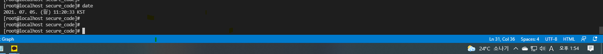

<p align="center">
  <a href="" rel="noopener">
 </a>
</p>

<h3 align="center">Secure coding</h3>

<!-- <div align="center">

[]()
[](https://github.com/jyos1426/secure_code/issues)

</div> -->

<p align="center"> 시큐어 코딩에 대한 기술조사 및 샘플링
    <br> 
</p>

# 📝 Table of Contents

* [1. 시큐어 코딩에 대한 기술조사](#search)
* [2. 프로젝트 반영 기술 선정](#selected)
* [3. 참고 문헌](#refer)
<br><br>

# 🧐 시큐어 코딩에 대한 기술조사 <a name = "search"></a>


## 1. [Angular.io](https://angular.io/guide/security)
Angular에 내장되어있는 보안 기술에대해 설명

Preventing cross-site scripting (XSS)
1. Angular의 XSS 방어 모델 <br>
: 프레임워크 계층에서 XSS 공격을 방어하기 위해 기본적으로 Angular는 모든 값을 신뢰할 수 없는 것으로 간주한다. 템플릿 DOM에 추가되는 values, properties, attributes, style, class binding, string binding은 모두 Angular가 안전성을 검사하고 보안에 위배되는 값을 제거한다.
2. 코드 안전성 검사(Sanitization) 와 보안 영역(security contexts)
* HTML 보안 영역: 어떤 값이 HTML로 변환되는 경우 (innerHTML)
* 스타일 보안 영역: style 프로퍼티로 CSS 코드가 바인딩되는 경우
* URL 보안 영역: a href 와 같은 엘리먼트에 URL 프로퍼티가 사용되는 경우
* 리소스 URL 보안 영역: script src 와 같이 외부 코드를 로드해서 실행하는 경우
3. 안전성 검사 예제
<br> : [샘플링 코드 참고](#sampling01)
4. DOM API를 직접 사용하는 경우와 명시적으로 안전성 검사를 실행하는 경우
<br> : ElementRef로 참조할 수 있는 document 노드나 서드 파티 API에는 보안에 취약한 메소드가 존재할 수 있음
<br> : 따라서 DOM을 직접 조작하지 말고 Angular의 템플릿을 최대한 활용
<br> : 안전이 확인되지 않은 코드에 DomSanitizer.sanitize 메소드를 사용하면 Angular가 자동으로 구성하는 것과 같은 SecurityContext를 구성할 수 있음
5. 안전한 값으로 간주하기
<br> : 1번 외의 값을 사용해야할 시 DomSanitizer를 사용해 신뢰할 수 있는 값으로 변환하여 사용 
<br>: [샘플링 코드 참고](#sampling02)
- Content-Security-Policy HTTP 헤더 사용
- AOT template compiler
<br> : template injection 이라고 불리는 모든 종류의 취약성을 방지
<br> Angular CLI application에서 사용하는 기본 컴파일러로, 모든 프로덕션 배포에 사용해야 함
- 서버에서 XSS 공격 방어
<br> : 서버에서 Angular 템플릿을 생성하지 않는 것이 좋음

HTTP 계층 취약점

- Cross-site request forgery
<br>: Angular가 제공하는 HttpClient은 same origin policy을 준수하기 때문에 XSRF 공격을 방어가능
- Cross-site script inclusion (XSSI)
<br>: Angular가 제공하는 HttpClient 라이브러리도 이 방식을 사용하며, 응답을 파싱한 뒤에는 ")]}',\n" 문자열을 자동으로 제거함

## 2. Angular Security Best Practices ([Angular-Security-Best-Practices.pdf](https://snyk.io/wp-content/uploads/Angular-Security-Best-Practices-1.pdf))
<br>

- The “Angular way” safeguards you from XSS
<br> Interpolation({{ }})을 사용하여 잠재적으로 위험한 문자를 안전하게 인코딩하고 템플릿 식 내에서 신뢰할 수 없는 HTML 또는 CSS 식을 escape

- Use innerHTML with caution
<br> HTML을 구성요소에 동적으로 추가해야 하는 경우 [innerHTML] 위치에 생성 바인딩

- Never use templates generated by concatenating user input
<br> 사용자 입력을 연결하여 생성한 템플릿을 사용하지 말 것
```
const potentialUserInput = `
  <!-- 잠재적 사용자 입력 -->
  
`;

@Components({
  template: `
  <div class="job">
    {{data.body}}
  <div>
  ` + potentialUserInput
})
export class TestComponent  {
  @Input() data: any;
}
```
이러한 취약성 방지하기 위해 After of Time 컴파일러를 사용하여 오프라인으로 템플릿을 컴파일할 것을 권장
```
ng build --aot
ng serve --aot
```

- Never use native DOM APIs to interact with HTML elements
<br> - 일반적으로 피해야할 사항
<br> 1. node.appendChild(); 사용
<br> 2. page와 상호작용 하기위한 document 객체 메소스 사용
<br> 3. jquery API 사용

- Avoid template engines on server-side templates
<br> Angular server rendering application에 3rd party template engine사용을 피함


- Scan your Angular project for components which introduce security vulnerabilities
<br> npm audit 또는 snyk를 사용하여 Angular 프로젝트 오픈 소스 종속성 및 Angular 구성 요소에서 보안 취약점을 검색
<br> [Snyk](#synk) 플랫폼 또는 CLI를 무료로 사용하여 보안 취약점을 찾아 수정하고 모니터링

<br>

---
<br>

# 🔧 프로젝트 반영 기술 선정 <a name = "selected"></a>

## 1. innerHTML 사용 예시 <a name = "sampling01"></a>
- src/app/inner-html
```
<p [innerHTML]="htmlSnippet"></p>
```
## 2. DomSanitizer 사용 예시 <a name = "sampling02"></a>

- src/app/bypass-security<br>

DOM 컨텍스트에서 안전하게 사용할 수 있도록, 위험한 값을 삭제하여 사이트 간 스크립팅 보안 버그 (XSS)를 방지하는 함수를 제공하는 클래스

```
abstract class DomSanitizer implements Sanitizer {
  abstract sanitize(context: SecurityContext, value: string | SafeValue): string | null
  abstract bypassSecurityTrustHtml(value: string): SafeHtml
  abstract bypassSecurityTrustStyle(value: string): SafeStyle
  abstract bypassSecurityTrustScript(value: string): SafeScript
  abstract bypassSecurityTrustUrl(value: string): SafeUrl
  abstract bypassSecurityTrustResourceUrl(value: string): SafeResourceUrl
}
```

## 3. snyk - [https://snyk.io](https://snyk.io/) <a name = "snyk"></a>
프로젝트의 의존성을 검사해서 사용되는 라이브러리(npm packages)의 취약점을 확인하는 보안 도구, tool chain에 연동하여 commit 이나 build, CI/CD 시 자동 모니터링 가능, container image 도 검사가능
```
npm install -g snyk
snyk test
```
- 검사 결과 예시
```
[root@localhost secure_code]# snyk test

Testing /workspace/secure_code...

Organization:      jyos1426
Package manager:   npm
Target file:       package-lock.json
Project name:      secure-coding
Open source:       no
Project path:      /workspace/secure_code
Licenses:          enabled

✓ Tested 12 dependencies for known issues, no vulnerable paths found.
```
# 🔧 참고 문헌 <a name = "refer"></a>

- [lesstif](https://www.lesstif.com/security/owasp-2020-10-91291830.html#OWASP202010%EB%8C%80%EC%B7%A8%EC%95%BD%EC%A0%90-A1.Injection(%EC%9D%B8%EC%A0%9D%EC%85%98)) - OWASP 2020 10대 취약점
- [kisa](https://www.kisa.or.kr/public/laws/laws3_View.jsp?cPage=6&mode=view&p_No=259&b_No=259&d_No=52&ST=T&SV=) - 기술안내서 가이드
- [Angular-Security-Best-Practices](https://snyk.io/wp-content/uploads/Angular-Security-Best-Practices-1.pdf)
- [Angular.io](https://angular.io/guide/security)

---
<br>

작업한 서버의 시간이 실제보다 3시간정도 느립니다. commit 시간은 무시해 주세요~ 

<br>

